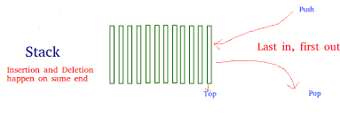

# Stack
## Jason Huang - CSE 212
---
## Introduction
#### A stack is a data structure that stores item in a Last-In/First-Out. This is frequently referred to as LIFO.

---

## Use of Stacks

#### In general, stacks are useful for processing nested structures or for functions which call other functions (or themselves). A nested structure is one that can contain instances of itself embedded within itself. For example, algebraic expressions can be nested because a sub expression of an algebraic expression can be another algebraic expression. Stacks are used to implement functions, parsers, expression evaluation, and backtracking algorithms.

---

## Implementing Stacks

#### There are a couple of options when you’re implementing a Python stack. The most common way is using a list.

### Using list to create a Python Stack

#### The built-in list structure that you likely use frequently in your programs can be used as a stack. Instead of .push(), you can use .append() to add new elements to the top of your stack, while .pop() removes the elements in the LIFO order:

---

## Stack in Python
| Common Stack Operation | Description| Python Code|Performance|
|---|----|----|----|
| push(value) | Adds "value" to the back of the stack. | **my_stack.append(value)** | O(1) - Performance of adding to the end of a dynamic array |
| pop() | Removes and returns the item from the back of the stack.| **value = my_stack.pop()** | O(1) - Performance of removing from the end of a dynamic array |
| size() | Return the size of the stack. | **length = len(my_stack)** | O(1) - Performance of returning the size of the dynamic array |
| empty() | Returns true if the length of the stack is zero. | **if len(my_stack) == 0:** | O(1) - Performance of checking the size of the dynamic array |
---

## Example
Description: 
Even if we didn't know what a stack was before today, we have actually been using stacks in all software we have written. When we call a function in our code, we are telling the computer two things:

1. Which function we want to call

2. Which function to go back to when we are done

Requirement:
The first of these is clear in our code. If we are currently in function A, then we expect to call function B. However, how do we tell the computer that we want to return to function A when function B is finished. This can be even more complicated by the fact that function B will need to call functions C before it can finish. The computer accomplishes this by using a function stack. When a function is called, it is pushed to the stack. The current function running is always on the back of the stack. When the function finishes, it is popped off the stack. The result is that the function to return to is the one that is on the back of the stack.

```python
myList = []

myList.append('a')
myList.append('b')
myList.append('c')
print(myList)
#[a,b,c]
myList.pop()
#It will remove the last item added, in this case 'c'
print(myList)
#[a,b]
myList.pop()
myList.pop()
myList.pop()
#It will raise an IndexError if you call .pop() on an empty stack.


```
---

## Problem to Solve
Description:
In addition to keeping track of the function name that is running, the stack also allows us to see where in the function we were when a function was originally called as well as the memory that we were using in our function. Stacks work well for remembering where we've been and the circumstances we were in during that previous time.

Requirement: 
When using Python or other programming languages, we will often see error messages that look like the following. Notice that the information is showing which functions have called which functions up until the point of error. This display of information comes directly from the function stack.
```python

class Stack():
    def __init__(self):
        self.items = []

    def insert(self, item):
    #Insert an item to the list

    #Your code goes here

    def remove(self):
    #Remove an item from the list

    #Your code goes here

    def is_empty(self):
    #check if the list is empty
        return self.items == []

    def peek(self):
    #check what is the last item of the list if it is not empty

    #your code goes here

    def get_stack(self):
        return self.items

myStack = Stack()
myStack.insert("A")
myStack.insert("B")
myStack.insert("C")
myStack.insert("D")
print(myStack.peek())
# [D]
myStack.remove()
myStack.remove()
print(myStack.get_stack())
# [A,B]
myStack.insert("E")
print(myStack.get_stack())
# [A,B,E]


```

You can find the solution [here](stack.py)