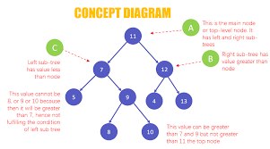

# Binary Trees
## Jason Huang - CSE 212
---
## Introduction
A Binary Search Tree (BST) is a tree in which all the nodes follow the belowmentioned properties
- The value of the key of the left sub-tree is less than the value of its parent
(root) node's key.
- The value of the key of the right sub-tree is greater than or equal to the value
of its parent (root) node's key.

Thus, BST divides all its sub-trees into two segments; the left sub-tree and the
right sub-tree and can be defined as

``` python
left_subtree (keys) < node (key) ≤ right_subtree (keys)
```

---

## Use of Binary Trees

In computing, binary trees are mainly used for searching and sorting as they
provide a means to store data hierarchically. Some common operations that can be
conducted on binary trees include insertion, deletion, and traversal.

---

## Basic Operations
Following are the basic operations of a binary tree:
- **Search** − Searches an element in a tree.
- **Insert** − Inserts an element in a tree.
- **Pre-order Traversal** − Traverses a tree in a pre-order manner.
- **In-order Traversal** − Traverses a tree in an in-order manner.
- **Post-order Traversal** − Traverses a tree in a post-order manner.

### Create Root
We just create a Node class and add assign a value to the node. This becomes tree
with only a root node.
```python
class Node:
 def __init__(self, data):
 self.left = None
 self.right = None
 self.data = data
 def PrintTree(self):
 print(self.data)
root = Node(10)
root.PrintTree()
```
When the above code is executed, it produces the following result −
```
10
```

## Insert into a Tree
To insert into a tree we use the same node class created above and add a insert
class to it. The insert class compares the value of the node to the parent node and
decides to add it as a left node or a right node. Finally the PrintTree class is
used to print the tree.
```python
class Node:
 def __init__(self, data):
 self.left = None
 self.right = None
 self.data = data
 def insert(self, data):

# Compare the new value with the parent node
 if self.data:
 if data < self.data:
 if self.left is None:
 self.left = Node(data)
 else:
 self.left.insert(data)
 elif data > self.data:
 if self.right is None:
 self.right = Node(data)
 else:
 self.right.insert(data)
 else:
 self.data = data

# Print the tree
 def PrintTree(self):
 if self.left:
 self.left.PrintTree()
 print( self.data),
 if self.right:
 self.right.PrintTree()

# Use the insert method to add nodes
root = Node(12)
root.insert(6)
root.insert(14)
root.insert(3)
root.PrintTree()
```
When the above code is executed, it produces the following result
```
3 6 12 14
```

## Traversing a tree
The tree can be traversed by deciding on a sequence to visit each node. As we can
clearly see we can start at a node then visit the left sub-tree first and right
sub-tree next. Or we can also visit the right sub-tree first and left sub-tree
next. Accordingly there are different names for these tree traversal methods.

### Tree Traversal Algorithms
Traversal is a process to visit all the nodes of a tree and may print their values
too. Because, all nodes are connected via edges (links) we always start from the
root (head) node. That is, we cannot randomly access a node in a tree. There are
three ways which we use to traverse a tree.
- In-order Traversal
- Pre-order Traversal
- Post-order Traversal
The code for traversing a BST is shown below

```python
def __iter__(self):
    """
 Perform a forward traversal (in order traversal) starting from
 the root of the BST. This is called a generator function.
 This function is called when a loop is performed:
    
    for value in my_bst:
        print(value)
    """
    yield from self._traverse_forward(self.root) # Start at the root

def _traverse_forward(self, node):
    """
    Does a forward traversal (in-order traversal) through the
    BST. If the node that we are given (which is the current
    subtree) exists, then we will keep traversing on the left
    side (thus getting the smaller numbers first), then we will
    provide the data in the current node, and finally we will
    traverse on the right side (thus getting the larger numbers last).
    
    The use of the 'yield' will allow this function to support loops
    like:
    
    for value in my_bst:
        print(value)
 
 The keyword 'yield' will return the value for the 'for' loop to
 use. When the 'for' loop wants to get the next value, the code in
 this function will start back up where the last 'yield' returned a
 value. The keyword 'yield from' is used when our generator function
 needs to call another function for which a `yield` will be called.
 
 In other words, the `yield` is delegated by the generator function to another function.
    
    This function is intended to be called the first time by the __iter__ function.
    """
    if node is not None:
        yield from self._traverse_forward(node.left)
        yield node.data
        yield from self._traverse_forward(node.right)
```

---
## BST in Python
| Common BST Operation | Description
| Performance
|
| -------------------- |
-----------------------------------------------------------------------------------
------------ |
-----------------------------------------------------------------------------------
--------------------------------------------------------- |
| insert(value) | Insert a value into the tree.
| O(log n) - Recursively search the subtrees to find the next available spot
|
| remove(value) | Remove a value from the tree.
| O(log n) - Recursively search the subtrees to find the value and then remove it.
This will require some cleanup of the adjacent nodes. |
| contains(value) | Determine if a value is in the tree.
| O(log n) - Recursively search the subtrees to find the value.
|
| traverse_forward | Visit all objects from smallest to largest.
| O(log n) - Recursively traverse the left subtree and then the right subtree.
|
| traverse_reverse | Visit all objects from largest to smallest.
| O(log n) - Recursively traverse the right subtree and then the left subtree.
|
| height(node) | Determine the height of a node. If the height of the tree
is needed, the root node is provided. | O(log n) - Recursively find the height of
the left and right subtrees and then return the maximum height (plus one to account
for the root). |
| size() | Return the size of the BST.
| O(1) - The size is maintained within the BST class.
|
| empty() | Returns true if the root node is empty. This can also be
done by checking the size for 0. | O(1) - The comparison of the root node or
the size.
|

---
## Example
```python
class Node:
 def __init__(self, data):
self.left = None
 self.right = None
 self.data = data
# Insert method to create nodes
 def insert(self, data):
 if self.data:
 if data < self.data:
 if self.left is None:
 self.left = Node(data)
 else:
 self.left.insert(data)
 else data > self.data:
 if self.right is None:
 self.right = Node(data)
 else:
 self.right.insert(data)
 else:
 self.data = data
# findval method to compare the value with nodes
 def findval(self, lkpval):
 if lkpval < self.data:
 if self.left is None:
 return str(lkpval)+" Not Found"
 return self.left.findval(lkpval)
 else if lkpval > self.data:
 if self.right is None:
 return str(lkpval)+" Not Found"
 return self.right.findval(lkpval)
 else:
 print(str(self.data) + ' is found')
# Print the tree
 def PrintTree(self):
 if self.left:
 self.left.PrintTree()
 print( self.data),
 if self.right:
 self.right.PrintTree()
root = Node(12)
root.insert(6)
root.insert(14)
root.insert(3)
print(root.findval(7))
print(root.findval(14))
```
```
7 Not Found
14 is Found
```
---
## Problem to solve
```python
# For this problem, you will need to create functions in order to create a tree
from a sorted list.
class TreeNode(object):
def __init__(self, x):
 self.val = x
 self.left = None
 self.right = None
def array_to_bst(array_nums):
 #This function will attempt to insert the item in the middle of the
"array_nums" into the Binary Tree. It should be done with recursive calls.
def preOrder(node):
 if not node:
 return
 print(node.val)
 preOrder(node.left)
 preOrder(node.right)
array_nums = [1,2,3,4,5,6,7]
print("Original array:")
print(array_nums)
result = array_to_bst(array_nums)
print("\nArray to a height balanced BST:")
print(preOrder(result))
```
You can find the solution [here](Solution.py)
